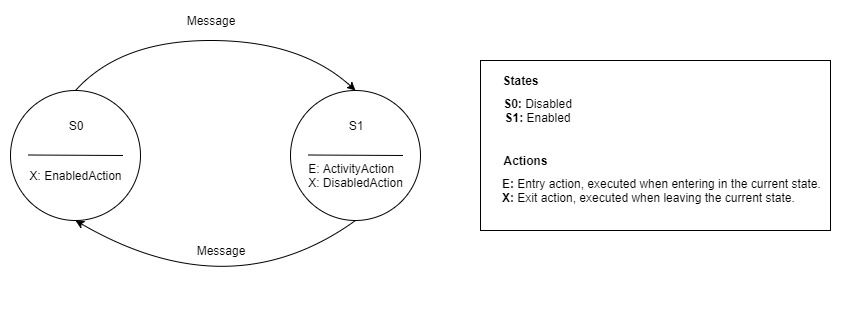

# Burglary Alarm: Changing Actor Behavior

One characteristic that makes the Actor model unique from object models is the actor’s ability to dynamically change its behavior.

This is a sample to illustrate how to change actor behavior:
Consider the case of a burglar alarm system; it can be enabled and disabled with a password, and its sensor detects activity. The alarm boils down to these states:

- **Enable:** If someone tries to enable the alarm with the correct password, it will be enable and the message *'Alarm enabled'* is logged. If the password is incorrect, the message *'Someone failed to enable the alarm'* is logged.

- **Disable:** If someone tries to disable the alarm with the correct password, it will be disabled and the message *'Alarm disabled'* is logged. If the password is incorrect, the message *'Someone who didn't know the password tried to disable it'* is logged.

- **Activity:** Sensor triggered when an activity is detected, logging a *'oeoeoeoeoe, alarm alarm!!!'*

To get a better overview, this is the Finite State Machine for this scenario:

You can find the source code [here](https://github.com/fernandoBRS/akka-java-samples/tree/master/samples/src/main/java/com/akka/sample/alarm).
