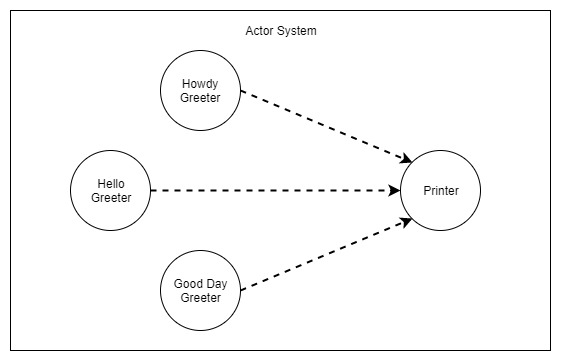

# Hello World Sample

## Overview

- **Howdy Greeter**, **Hello Greeter** and **Good Day Greeter** actors are introduced to **Printer** actor though their references.
- Printer actor is responsible for logging all messages received.

You can find the source code [here](https://github.com/fernandoBRS/akka-java-samples/tree/master/samples/src/main/java/com/akka/sample/helloworld).
