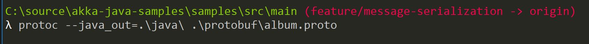

# Messages Serialization: Performance and Security Improvements

## Akka Serialization

Akka makes use of serialization when messages leave the JVM boundaries. This can happen in mainly two scenarios: sending messages over the network when using Akka Cluster or using Akka Persistence.

However, the default serialization mechanism configured in Akka is nothing but the **infamous** Java serialization, which Mark Reinhold called a ["horrible mistake" and which Oracle plans to dump in the near future anyway](https://developers.slashdot.org/story/18/05/26/0520227/oracle-calls-java-serialization-a-horrible-mistake-plans-to-dump-it).

The Akka documentation discourages the use of Java serialization : **"One may think that network bandwidth and latency limit the performance of remote messaging, but serialization is a more typical bottleneck."**

Performance is one reason to not use Java serialization – but also it has many object serialization vulnerabilities. If you want to go deep into this topic, I strongly recommend you to wtach this presentation: [How deserializing objects can ruin your day](https://www.youtube.com/watch?v=KSA7vUkXGSg).

## About the sample

The sample uses [Protocol Buffers](https://developers.google.com/protocol-buffers/) structure to serialize messages (remember the serialization is done internally by Akka). There are quite few serializers around (like Kryo, Avro, SBE, etc). In this sample I'm using Protocol Buffers because it's very stable and straightforward to use in Akka.

The sample is very similar to the first one – [Hello World](https://github.com/fernandoBRS/akka-java-samples/tree/master/samples/src/main/java/com/akka/sample/helloworld) –but replacing the Java serializer by Protocol Buffers.


You can find the sample source code [here](https://github.com/fernandoBRS/akka-java-samples/tree/master/samples/src/main/java/com/akka/sample/serialization).

## Akka Project Configuration

The following process is not required if you just downloaded this repo and build the project. However, if you want to create a project from scratch there are some important notes for you to not getting stuck (as I was during the creation of this sample 😓 - ok, it's not so straightforward).

If you're using Maven, add Protocol Buffers as dependency. You can check what's the latest version [here](https://mvnrepository.com/artifact/com.google.protobuf/protobuf-java).

```xml
<dependency>
    <groupId>com.google.protobuf</groupId>
    <artifactId>protobuf-java</artifactId>
    <version>3.6.1</version>
</dependency>
```

Create a new **application.conf** file to adjust Akka configuration for actors (usually this file is under main/java/resources):

```conf
akka {
    actor {
        # disable Java serialization 
        akka.actor.allow-java-serialization = off

        # which serializers are available under which key
        serializers {
            proto = "akka.remote.serialization.ProtobufSerializer"
        }

        # which interfaces / traits / classes should be handled by which serializer
        serialization-bindings {
            "com.google.protobuf.Message" = proto
        }
    }
}
```

## Defining Message Formats

It's recommended to define one message protocol for each actor. Each protocol is defined in a **.proto** file (usually under main/java/protobuf). There's a good tutorial about protocols [here](https://developers.google.com/protocol-buffers/docs/javatutorial). Example:

```proto
syntax = "proto3";
option java_package = "com.akka.sample.serialization.models.print";

// Events

message Greeting {
    string message = 1;
}
```

After that you have to generate Java classes using the protocol compiler called **protoc** (you can download it [here](https://github.com/protocolbuffers/protobuf/releases/tag/v3.6.1)). There are basically two good recommendations to generate Java classes with protoc:

- If you're using VS Code, there's an awesome extension called [vscode-proto3](https://marketplace.visualstudio.com/items?itemName=zxh404.vscode-proto3). This is how I configured my VS Code **.settings** file:

    ```json
    {
        "protoc": {
            "path": "C:/protoc-3.6.0-win32/bin/protoc.exe" ,
            "options": [
                "--proto_path=src/main/protobuf",
                "--java_out=src/main/java"
            ]
        }
    }
    ```

- You can use protoc via command line. For example:

    


    *Note: If you're on Windows, make sure you have defined protoc as environment variable.*

Now you can instantiate your classes by using the **Protocol Buffers Builder**. For example:

```csharp
WhoToGreet whoToGreetMessage = WhoToGreet.newBuilder()
    .setWho("Akka")
    .build();
```

For more details, check the **SerializedHelloWorld.java** file.
