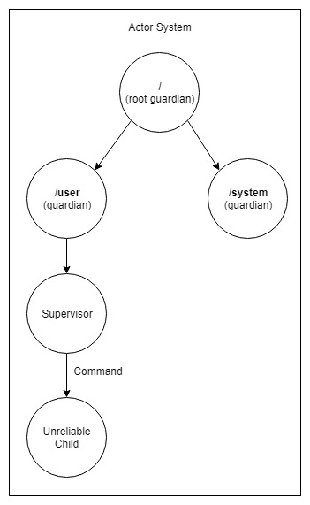

# Transient Fault Handling: Implementing a Supervisor

An *Unreliable* child actor receives *Command* messages from parent actor (Supervisor) and increases an internal counter with each message. If the message count is divisible by 4 it throws a *RuntimeException*, which will be escalated to the Supervisor.

## Supervisor Strategy Requirements

- Maximum number of retries to restart the child actor: 2 retries.
- Time range between retries: 10 seconds.

## Source Code

You can find the source code [here](https://github.com/fernandoBRS/akka-java-samples/tree/master/samples/src/main/java/com/akka/sample/supervisor).
